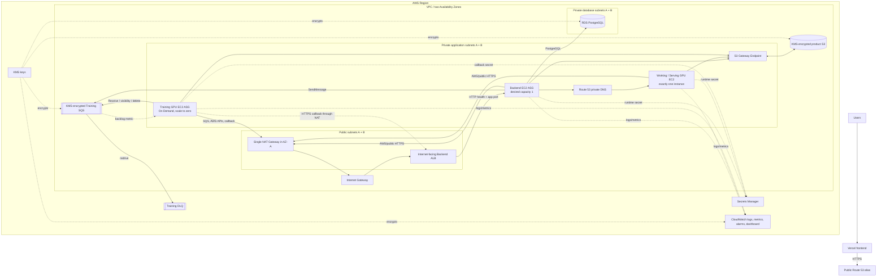
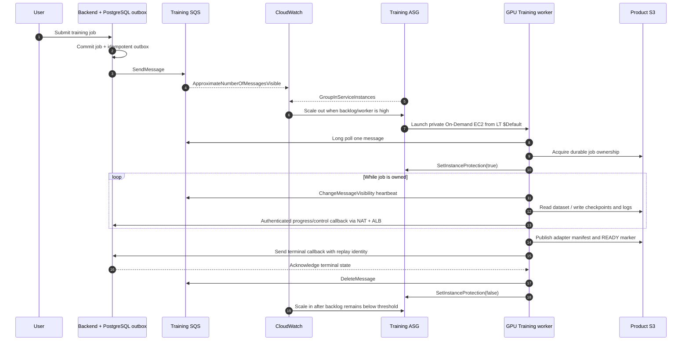
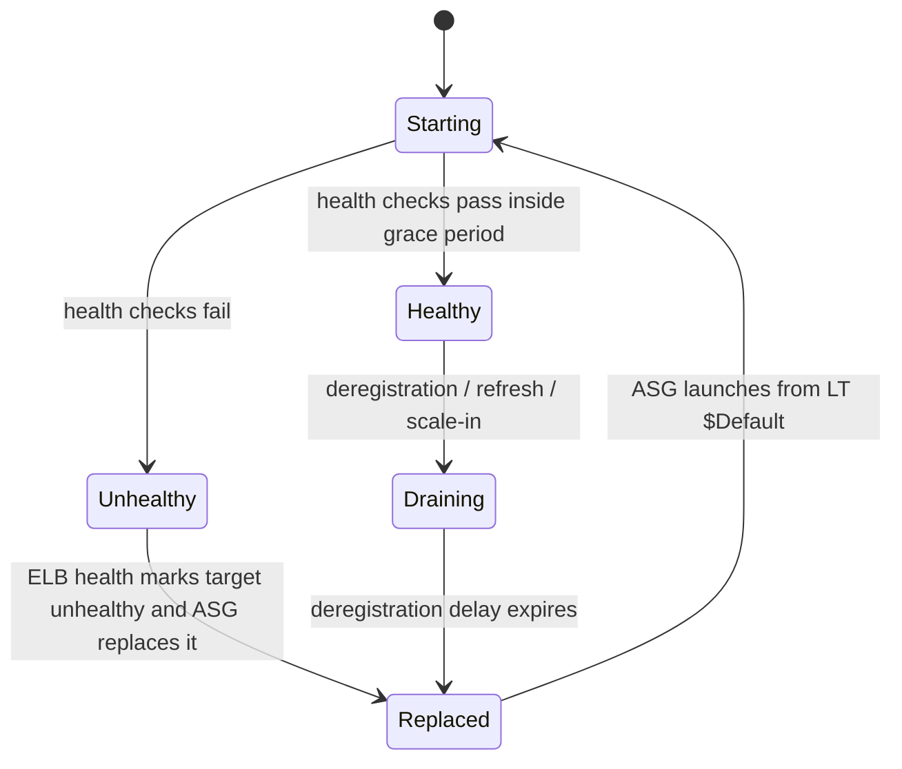

# Personal LoRA on AWS — Terraform Infrastructure

[English](README.md) | [简体中文](README.zh-CN.md)

This repository implements the AWS infrastructure for Personal LoRA: a public Backend control
plane, a private single-node GPU inference service (**Working / Serving**), and an ephemeral,
SQS-driven GPU training fleet (**Training**). The frontend remains on Vercel.

> **Implementation status** — The Terraform resource graph, policies, bootstrap root, compute,
> scaling, and observability configuration are implemented and locally validated. This statement
> describes repository implementation, not proof of a live AWS deployment. No live plan/apply or
> production verification is claimed here.

## Architecture at a glance



The only public application resource is the Backend ALB. Backend, Working, Training, and RDS have
no public IP. There is no inbound SSH; controlled host access uses AWS Systems Manager.

## Compute model

| Plane | AWS compute | Entry path | Scaling and release behavior |
| --- | --- | --- | --- |
| Backend | Private EC2 Launch Template + ASG across two AZs | Public ALB → private target group | Starts at `desired = 1`; AMI-only LT release promotes `$Default`, then Backend Instance Refresh |
| Working / Serving V0 | Exactly one private GPU `aws_instance` | Backend → Route 53 private DNS | No LT, ASG, target group, or ALB; an approved AMI input change replaces the instance |
| Training | Private On-Demand GPU Launch Template + ASG | SQS long polling; no listener | SQS backlog scales from zero; protected jobs are never force-refreshed during normal AMI releases |

### Backend control plane

The Backend runs in both private application subnets behind an internet-facing ALB. Terraform
implements:

- a hardened Launch Template with exact AMI input, IMDSv2, encrypted EBS, instance profile, and
  non-secret user data;
- an ASG using LT version `$Default`, ELB health checks, warmup/grace settings, and target-group
  registration;
- an ALB across both public subnets, HTTP `80` redirect-only, HTTPS `443`, an ACM certificate,
  Route 53 alias, invalid-header dropping, configurable idle timeout, and deletion protection;
- private access to PostgreSQL, Working, S3, SQS, Secrets Manager, logs, metrics, and SSM.

Database migrations are deliberately excluded from instance startup. They are a singleton,
failure-closed release step so multiple ASG instances cannot race schema changes.

### Working / Serving GPU EC2

Working V0 is intentionally simple: one private GPU EC2 instance, one stable private DNS record,
and no load balancer or Auto Scaling Group. The Backend calls the Adapter Manager through private
DNS; vLLM remains local to the host/container boundary.

Terraform configures:

- exact approved AMI and GPU instance type inputs;
- encrypted root and cache EBS volumes;
- IMDSv2-only metadata, no public IP, and SSM access without SSH;
- a dedicated runtime role and security group accepting the inference port only from Backend;
- S3 adapter/model access through the Gateway Endpoint and secret retrieval at runtime;
- Route 53 private `A` record tracking the instance private IP.

An AMI change is a replacement and can cause downtime. Durable adapters and manifests live in S3;
the local cache is disposable.

## How SQS starts and stops Training EC2

SQS does **not** invoke EC2 directly. The implementation connects queue depth to the Training ASG
through CloudWatch metric math and Simple Scaling policies.



### Scale-from-zero formula

Both scale-out and scale-in alarms evaluate:

```text
IF(InService > 0, VisibleMessages / InService, VisibleMessages)
```

At zero workers, visible messages are used directly, so the first queued job can trigger scale-out.
At nonzero capacity, the signal becomes backlog per in-service worker. Periods, alarm datapoints,
thresholds, adjustments, cooldowns, and warmup are required reviewed inputs rather than hidden
production defaults. Terraform ignores only autoscaling-owned `desired_capacity`; it continues to
own min/max capacity and all other ASG structure.

### Queue reliability

- The Backend commits a PostgreSQL outbox record before publishing, so an SQS outage cannot lose
  an accepted job and a retry remains idempotent.
- The main queue and DLQ use a dedicated rotating KMS key.
- Long polling, visibility timeout, renewal interval, retention, redrive count, and DLQ retention
  are typed inputs with validation.
- The worker accepts one message, validates the frozen envelope, acquires durable ownership in S3,
  and treats SQS Standard delivery as at-least-once.
- Visibility is renewed while a job is owned. Repeated renewal failure causes fail-closed lease
  loss rather than continuing expensive work without authority.
- A terminal message is deleted only after durable terminal state and Backend acknowledgement.

## Kill, drain, and protection logic

“Kill” and “protect” refer to different AWS control planes in this architecture.

### Backend ALB and ASG



- **ALB health removal:** failed target health checks stop new requests from being routed to an
  unhealthy Backend instance.
- **ASG replacement (“kill”):** because Backend uses `health_check_type = "ELB"`, an unhealthy
  instance can be replaced by the ASG after the configured grace/health conditions.
- **Startup protection:** `health_check_grace_period` and default instance warmup prevent a new
  instance from being judged too early.
- **Connection draining:** target-group `deregistration_delay` lets in-flight requests finish before
  deregistration completes.
- **Release protection:** the ASG instance-maintenance policy bounds minimum and maximum healthy
  percentages during a reviewed Instance Refresh.
- **ALB deletion protection:** `enable_deletion_protection` protects the ALB resource from deletion;
  it does not protect individual EC2 instances.

### Training ASG

- After strict validation and durable job ownership, the worker calls
  `SetInstanceProtection(ProtectedFromScaleIn=true)` for its own instance.
- Scale-in alarms may reduce desired capacity, but Auto Scaling skips an instance protected by an
  active job.
- The worker maintains SQS visibility, checkpoints at safe points, sends authenticated callbacks,
  persists terminal state, receives the terminal acknowledgement, deletes the message, and only
  then clears scale-in protection in a `finally` path.
- Terraform creates an `EC2_INSTANCE_TERMINATING` lifecycle hook with configurable heartbeat and
  default result, and the Training role is scoped for `CompleteLifecycleAction`,
  `RecordLifecycleActionHeartbeat`, and `SetInstanceProtection` on its own ASG.
- Normal Training AMI releases promote LT `$Default` for future scale-outs only. They do not run an
  Instance Refresh, remove protection, or terminate a protected worker. Mixed AMI versions during
  draining are expected.

Current integration note: the runtime implements scale-in protection and graceful SIGTERM/checkpoint
handling. The Terraform lifecycle hook and IAM contract are present, while direct worker calls to
`CompleteLifecycleAction` / `RecordLifecycleActionHeartbeat` are not yet present in the sibling GPU
runtime. The sibling Backend's current SQS/callback payload and authentication semantics also still
need alignment with the frozen GPU worker contract. These are application-integration boundaries;
the AWS resources and routes described here are implemented. Do not interpret the infrastructure
graph alone as live end-to-end lifecycle or callback evidence.

## Network and traffic paths

| Path | Route and trust boundary |
| --- | --- |
| Public API | Internet → ALB SG `80` redirect or `443` TLS → Backend SG application port |
| Backend → RDS | Backend SG → database SG on the PostgreSQL port; no Working/Training DB path |
| Backend → Working | Backend SG → Working SG on one private service port via Route 53 private DNS |
| Runtime → S3 | Private application route table → S3 Gateway Endpoint → product bucket |
| Runtime → AWS/public APIs | Private application subnet → single NAT in AZ-A → IGW |
| Training callback | private Training EC2 → NAT EIP → public Backend ALB → private Backend |

The initial cost-optimized design uses one NAT Gateway. This is an accepted single point of
failure, and AZ-B workloads incur cross-AZ egress when using NAT-A. Paid interface endpoints are
deferred; the future endpoint security group is already reserved. Private database subnets have no
internet default route.

## AWS resources implemented

| Domain | Resources |
| --- | --- |
| State | Separate `bootstrap/state` root; versioned/private S3 bucket, KMS key, TLS-only policy, native S3 lockfile |
| Network | VPC, 2 public + 2 private-app + 2 private-DB subnets, IGW, one EIP/NAT, route tables, S3 Gateway Endpoint, private hosted zone |
| Edge | Public ALB, target group, HTTP redirect listener, HTTPS listener, public Route 53 alias |
| Compute | Backend LT/ASG, one Working EC2 + private record, Training LT/ASG + termination hook + scaling policies |
| Data | KMS-encrypted/versioned product S3, private PostgreSQL RDS with managed master secret |
| Messaging | KMS-encrypted Training queue and DLQ, redrive and resource policies |
| Identity | GitHub OIDC provider; separate Terraform, Packer, release, Backend, Working, and Training roles/profiles |
| Operations | SSM core access, encrypted runtime/VPC Flow Log groups, VPC Flow Logs |
| Monitoring | ALB/Backend, SQS/DLQ, Working EC2, RDS, NAT alarms; shared dashboard |
| Cost | Monthly Budget and Cost Anomaly monitor/subscription |

## Security model

- No application EC2 or RDS resource receives a public IP.
- No inbound SSH rule exists; IMDSv2 is required and EBS volumes are encrypted.
- Security-group references enforce ALB → Backend, Backend → Working, and Backend → RDS paths.
- Training has no ingress rule and no application listener.
- Separate runtime roles prevent Working and Training from reaching RDS; Training can manage only
  its own queue, approved S3 prefixes/KMS keys, callback secret, logs, and ASG lifecycle surface.
- Secrets are retrieved at runtime. Terraform/user data carries secret ARNs or identifiers, never
  secret values.
- Product S3 blocks all public access, enforces TLS, uses Bucket Owner Enforced ownership,
  versioning, KMS encryption, and `prevent_destroy`.
- RDS is private, KMS-encrypted, backup/deletion controlled, and uses an AWS-managed master-user
  secret. Terraform outputs only the secret ARN.
- GitHub workflows use short-lived OIDC roles; build, release, deploy, and runtime permissions are
  separate.

## AMI and release ownership

Terraform owns resource structure. Routine releases own only the narrow AMI surface:

| Component | Routine release |
| --- | --- |
| Backend | Clone current LT `$Default`, change only `ImageId`, verify semantic diff, promote `$Default`, run and observe Instance Refresh |
| Training | Clone current LT `$Default`, change only `ImageId`, verify and promote; no forced refresh of protected workers |
| Working V0 | Change exact Terraform AMI input, review saved plan, replace the single instance and update private DNS |

Backend and Training Launch Templates use `update_default_version = false`, ASGs reference
`$Default`, and Terraform ignores only release-owned `image_id`. Instance profile, user data,
security groups, instance type, disks, metadata, capacity, and scaling remain visible as
Terraform-owned drift. Production AMIs are exact immutable IDs; there is no `most_recent` lookup.

## Observability and operations

- KMS-encrypted Backend, Working, Training, and VPC Flow Log groups with explicit retention.
- Queue depth/age and DLQ alarms; Backend unhealthy target, capacity, 5xx, and latency alarms;
  Working EC2 status; RDS CPU/free storage; NAT port-allocation/drop alarms.
- Shared CloudWatch dashboard for ALB, ASGs, SQS, RDS, Working, and NAT.
- Monthly tagged budget and daily service-level cost anomaly notifications.
- Runbooks for SSM access, single-NAT outage, two-NAT upgrade/rollback, resource retention/deletion,
  Backend plan review, Working replacement, and singleton database migration.

Infrastructure-native metrics are wired here. GPU, disk, process, callback, lifecycle, and job
outcome metrics must be emitted by their owning runtime before they can produce live data.

## Repository layout

```text
.
├── bootstrap/state/              # Independently initialized remote-state bootstrap root
├── templates/                    # Non-secret Backend/Working/Training runtime environment scripts
├── tests/                        # Terraform mock-provider tests
├── ai/                           # Architecture constraints and integration contracts
├── routeMap/                     # Design, release, operations, validation, and factual dev records
├── backend.tf                    # Partial remote-state backend contract
├── versions.tf / providers.tf    # Terraform and AWS provider contract
├── variables.tf / locals.tf      # Shared inputs, names, tags, and derived values
├── foundation_checks.tf          # Cross-domain safety checks
├── network.tf                    # VPC, subnets, routes, DNS, NAT, and S3 endpoint
├── security.tf                   # Security groups, rules, inputs, and outputs
├── data_storage.tf               # Product S3, KMS, policies, inputs, and outputs
├── messaging.tf                  # Training SQS, DLQ, KMS, policies, inputs, and outputs
├── database.tf                   # PostgreSQL RDS, KMS, inputs, and outputs
├── iam.tf                        # OIDC, deploy/build/release/runtime IAM
├── backend_compute.tf            # Backend LT, ASG, ALB, HTTPS, inputs, and outputs
├── working_compute.tf            # Single private Serving EC2, DNS, inputs, and outputs
├── training_compute.tf           # Training LT, ASG, lifecycle, scaling, inputs, and outputs
└── observability.tf              # Logs, alarms, dashboard, flow logs, and cost controls
```

## Using the repository

### Prerequisites

- Terraform `>= 1.13.3, < 1.14.0`
- AWS provider `~> 6.47.0`
- TFLint `0.64.0` with AWS ruleset `0.48.0`
- Trivy Config `0.72.0`
- An approved AWS account/region/environment and complete non-secret input set
- Exact approved AMI IDs, external ACM/Route 53/secret/SNS identifiers, and AWS credentials
  supplied outside Git

### Local validation without AWS credentials

```bash
terraform init -backend=false
terraform fmt -check -recursive
terraform validate -no-color
terraform test -no-color
tflint --recursive --format compact
trivy config --config trivy.yaml .
```

Tests use `mock_provider "aws"`; their account IDs, AMIs, domains, and thresholds are fixtures, not
deployment defaults.

### Remote state bootstrap

`bootstrap/state` is a separate Terraform root because Terraform cannot consume a backend before
it exists. It creates the protected State bucket and KMS key. The environment root then receives
`bucket`, `key`, `region`, and account-specific access configuration outside Git and uses native
S3 lockfiles (`use_lockfile = true`), without DynamoDB.

### Deployment boundary

A live `terraform plan` requires explicit authorization and a named account, region, and
environment. Apply the exact reviewed saved plan only after separate approval. Do not use test
fixtures in a live plan, and do not treat permission to edit this repository as permission to
modify AWS.

## Important outputs

The root exports stable, non-secret references for network/subnets, NAT EIP, private zone,
security groups, product S3/KMS, Training queue/DLQ/KMS, RDS endpoint and managed-secret ARN,
runtime/workflow roles, Backend LT/ASG/ALB/public URL, Working instance/private URL, Training
LT/ASG/lifecycle hook/callback URL, log groups, and dashboard name.

## Design references

- [`routeMap/TERRAFORM_AWS_DESIGN.md`](routeMap/TERRAFORM_AWS_DESIGN.md) — authoritative topology
- [`routeMap/AMI_ASG_RELEASE_DESIGN.md`](routeMap/AMI_ASG_RELEASE_DESIGN.md) — AMI/LT/ASG ownership
- [`routeMap/OPERATIONS_RUNBOOK.md`](routeMap/OPERATIONS_RUNBOOK.md) — operations and failure handling
- [`routeMap/RELEASE_WORKFLOW_CONTRACT.md`](routeMap/RELEASE_WORKFLOW_CONTRACT.md) — release gates
- [`routeMap/SERVICE_VALIDATION_RUNBOOK.md`](routeMap/SERVICE_VALIDATION_RUNBOOK.md) — Backend/Working verification
- [`routeMap/TERRAFORM_DEV_DOC.md`](routeMap/TERRAFORM_DEV_DOC.md) — factual implementation record
