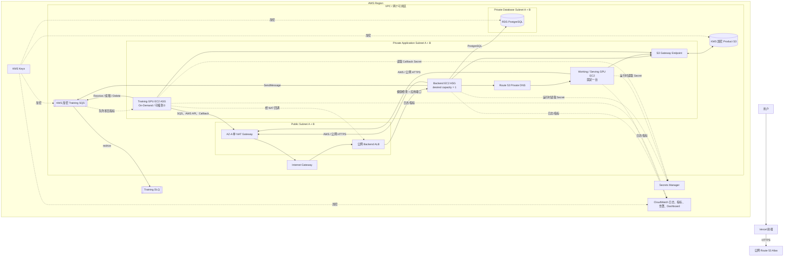
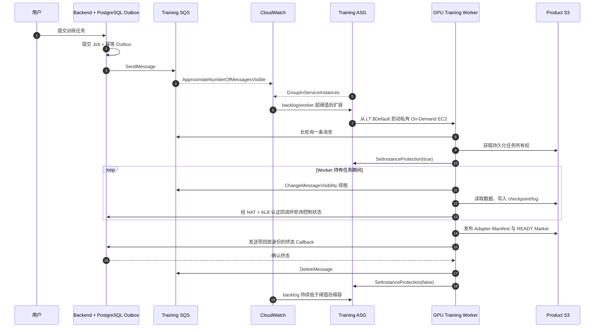
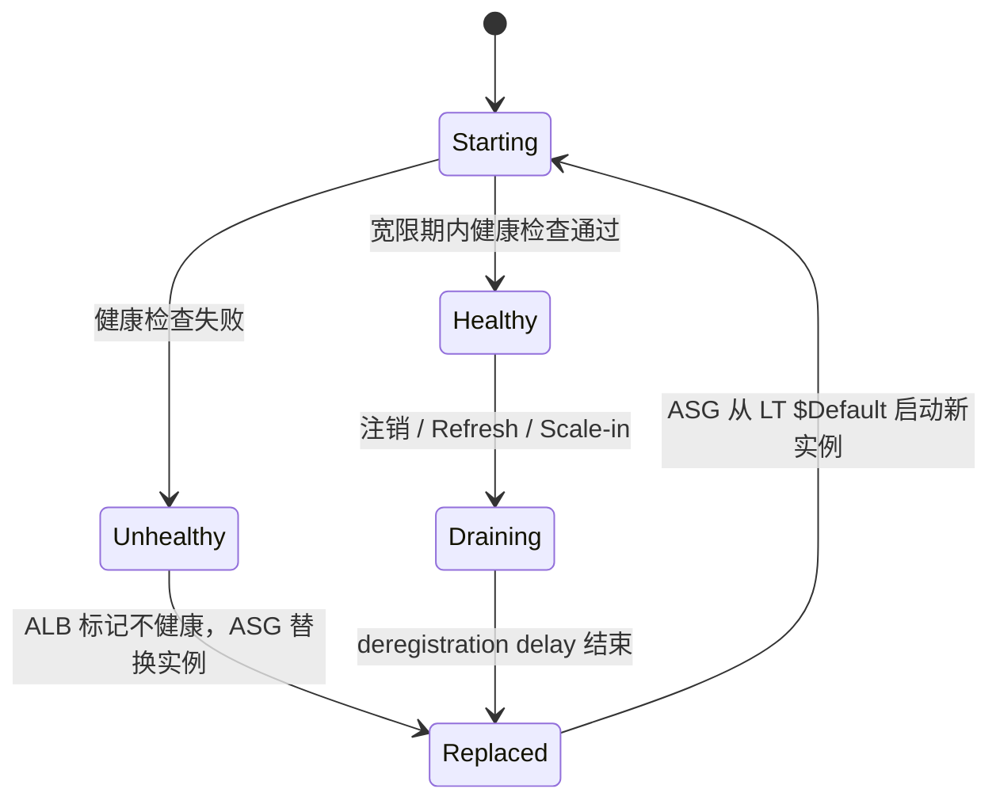

# Personal LoRA AWS 基础设施 — Terraform

[English](README.md) | [简体中文](README.zh-CN.md)

本仓库实现 Personal LoRA 的 AWS 基础设施：对外提供 API 的 Backend 控制面、单机私有 GPU
推理服务（**Working / Serving**），以及由 SQS 驱动、按需启动的 GPU 训练集群（**Training**）。
前端继续部署在 Vercel，不由本仓库管理。

> **实现状态**：Terraform 资源图、权限策略、State bootstrap、计算、扩缩容与可观测性配置均已
> 在仓库中实现并通过本地验证。这里描述的是代码实现，不代表某个 AWS 环境已经完成 live
> plan/apply 或生产验证。

## 系统架构总览



唯一公网应用资源是 Backend ALB。Backend、Working、Training 和 RDS 都没有公网 IP；安全组
没有开放 SSH，受控运维通过 AWS Systems Manager 完成。

## 三类计算资源

| 平面 | AWS 计算模型 | 入口 | 扩缩容与发布 |
| --- | --- | --- | --- |
| Backend | 跨两个 AZ 的私有 EC2 Launch Template + ASG | 公网 ALB → 私有 Target Group | 初始 `desired = 1`；AMI-only LT 版本提升为 `$Default` 后执行 Backend Instance Refresh |
| Working / Serving V0 | 固定一台私有 GPU `aws_instance` | Backend → Route 53 Private DNS | 没有 LT、ASG、Target Group 或 ALB；修改审核过的 AMI 输入会替换实例 |
| Training | 私有 On-Demand GPU Launch Template + ASG | SQS 长轮询，无监听端口 | 根据 SQS backlog 从 0 扩容；正常 AMI 发布不会强制刷新受保护任务 |

### Backend 控制面

Backend 位于两个 Private Application Subnet，通过公网 ALB 提供服务。Terraform 已实现：

- 使用精确 AMI 输入、IMDSv2、加密 EBS、独立 Instance Profile 与无 Secret user data 的
  Launch Template；
- 使用 LT `$Default` 的 ASG、ELB 健康检查、启动宽限期/预热和 Target Group 注册；
- 跨两个 Public Subnet 的 ALB、HTTP `80` 仅跳转 HTTPS、HTTPS `443`、ACM 证书、Route 53
  Alias、非法 Header 丢弃、idle timeout 与 deletion protection；
- 到 PostgreSQL、Working、S3、SQS、Secrets Manager、CloudWatch 与 SSM 的最小权限路径。

数据库迁移不会在每台 ASG 实例启动时运行，而是独立的 singleton、失败即阻断发布步骤，避免
多实例并发修改 Schema。

### Working / Serving GPU EC2

Working V0 有意保持简单：一台私有 GPU EC2、一个稳定的 Private DNS，不使用 ALB 或 ASG。
Backend 只通过 Private DNS 调用 Adapter Manager；vLLM 保持在本机/容器内部边界。

Terraform 配置包括：

- 精确审核的 AMI 与 GPU instance type；
- 加密的 root/cache EBS；
- 仅 IMDSv2、无公网 IP、SSM 运维且不开放 SSH；
- 独立 runtime role 与 security group，仅允许 Backend 访问推理端口；
- 通过 S3 Gateway Endpoint 访问 adapter/model，Secret 在运行时读取；
- 指向实例私网 IP 的 Route 53 Private `A` 记录。

AMI 更新会替换实例并产生预期停机。持久化 adapter 与 manifest 存放在 S3，本地 cache 可丢弃。

## SQS 如何拉起和关闭 Training EC2

SQS **不会直接调用 EC2**。实现链路是：队列深度进入 CloudWatch metric math，再触发 Training
ASG 的 Simple Scaling policy。



### 从 0 扩容的公式

扩容和缩容告警都使用：

```text
IF(InService > 0, VisibleMessages / InService, VisibleMessages)
```

当 Worker 数为 0 时直接使用可见消息数，因此第一条消息就能触发 scale-out；存在 Worker 时使用
每台 InService Worker 的 backlog。Metric period、datapoints、阈值、扩缩容步长、cooldown 和
warmup 都是必须审核的输入，而不是隐藏默认值。Terraform 只忽略 autoscaling 管理的
`desired_capacity` 变化，min/max 与其他 ASG 结构仍由 Terraform 管理。

### 队列可靠性

- Backend 先提交 PostgreSQL Outbox 再发布 SQS；SQS 暂时失败不会丢失已接受任务，重复提交可
  幂等重试。
- Main Queue 与 DLQ 使用独立轮换 KMS Key。
- Long polling、visibility timeout、续租周期、retention、redrive count 与 DLQ retention 均为
  带校验的强类型输入。
- Worker 一次只取一条消息，先严格校验冻结的消息协议，再在 S3 中获取持久化所有权；SQS
  Standard Queue 按 at-least-once 处理。
- 持有任务期间持续续租；连续续租失败会判定 lease lost 并 fail closed，不会在失去所有权后继续
  消耗 GPU。
- 只有持久化终态并获得 Backend 确认后才删除消息。

## Kill、Drain 与 Protect 逻辑

该架构里的 “kill” 和 “protect” 属于不同 AWS 控制面。

### Backend ALB + ASG



- **ALB 摘除**：Target health check 失败后，ALB 停止向不健康 Backend 实例分发新请求。
- **ASG 替换（常被称为 kill）**：Backend 使用 `health_check_type = "ELB"`，持续不健康的实例会在
  宽限期与健康条件满足后由 ASG 替换。
- **启动保护**：`health_check_grace_period` 与 default instance warmup 避免新实例过早被判死。
- **连接排空**：Target Group 的 `deregistration_delay` 允许已有请求在注销完成前结束。
- **发布保护**：ASG instance-maintenance policy 限制 Instance Refresh 期间的最低/最高健康比例。
- **ALB deletion protection**：只保护 ALB 资源不被删除，不保护单台 EC2。

### Training ASG

- 严格校验并取得持久化任务所有权后，Worker 对自己的实例调用
  `SetInstanceProtection(ProtectedFromScaleIn=true)`。
- 缩容告警可以降低 desired capacity，但 Auto Scaling 会跳过正在执行任务的 protected instance。
- Worker 持续更新 SQS visibility，在安全点 checkpoint，经认证回调，持久化终态，获得终态确认，
  删除消息，最后才在 `finally` 路径解除 scale-in protection。
- Terraform 创建 `EC2_INSTANCE_TERMINATING` lifecycle hook（heartbeat 与 default result 可配置），
  Training Role 只对本 ASG 授予 `CompleteLifecycleAction`、
  `RecordLifecycleActionHeartbeat` 和 `SetInstanceProtection`。
- 正常 Training AMI 发布只把新的 LT 版本提升为 `$Default`，供后续 scale-out 使用；不会执行
  Instance Refresh、移除保护或终止 protected worker。Drain 期间混合 AMI 版本是预期状态。

当前集成说明：GPU runtime 已实现 scale-in protection 与优雅 SIGTERM/checkpoint；Terraform 的
lifecycle hook 和 IAM contract 已存在，但同级 GPU runtime 目前尚未直接调用
`CompleteLifecycleAction` / `RecordLifecycleActionHeartbeat`。同级 Backend 当前的 SQS/Callback
Payload 与认证语义也仍需和冻结的 GPU Worker Contract 对齐。这些属于应用集成边界；本文描述的
AWS 资源和路由已经实现，但不能仅凭基础设施图宣称端到端 Lifecycle 或 Callback 已验证。

## 网络与流量路径

| 流量 | 路由与信任边界 |
| --- | --- |
| 公网 API | Internet → ALB SG `80` 跳转或 `443` TLS → Backend SG 应用端口 |
| Backend → RDS | Backend SG → Database SG 的 PostgreSQL 端口；Working/Training 无数据库路径 |
| Backend → Working | Backend SG → Working SG 单一私有端口，经 Route 53 Private DNS |
| Runtime → S3 | Private Application Route Table → S3 Gateway Endpoint → Product Bucket |
| Runtime → AWS/公网 API | Private Application Subnet → AZ-A 单 NAT → IGW |
| Training Callback | 私有 Training EC2 → NAT EIP → 公网 Backend ALB → 私有 Backend |

首版使用单 NAT Gateway 以控制成本。这是已接受的单点故障，AZ-B workload 使用 NAT-A 时还会产生
跨 AZ 流量费。付费 Interface Endpoint 暂缓，但已预留 Endpoint Security Group。Private Database
Subnet 没有 Internet Default Route。

## 已实现的 AWS 资源

| 领域 | 资源 |
| --- | --- |
| State | 独立 `bootstrap/state` Root；版本化私有 S3、KMS、TLS-only Policy、原生 S3 Lockfile |
| Network | VPC、2 Public + 2 Private App + 2 Private DB Subnet、IGW、单 EIP/NAT、Route Table、S3 Gateway Endpoint、Private Hosted Zone |
| Edge | 公网 ALB、Target Group、HTTP Redirect Listener、HTTPS Listener、Public Route 53 Alias |
| Compute | Backend LT/ASG、单 Working EC2 + Private Record、Training LT/ASG + Termination Hook + Scaling Policy |
| Data | KMS 加密/版本化 Product S3、私有 PostgreSQL RDS 与 Managed Master Secret |
| Messaging | KMS 加密 Training Queue/DLQ、Redrive 与 Resource Policy |
| Identity | GitHub OIDC；独立 Terraform、Packer、Release、Backend、Working、Training Role/Profile |
| Operations | SSM Core、加密 Runtime/VPC Flow Log Group、VPC Flow Logs |
| Monitoring | ALB/Backend、SQS/DLQ、Working EC2、RDS、NAT 告警与共享 Dashboard |
| Cost | Monthly Budget、Cost Anomaly Monitor/Subscription |

## 安全模型

- Application EC2 与 RDS 均无公网 IP。
- 不开放 SSH；强制 IMDSv2，EBS 全部加密。
- Security Group 引用严格限定 ALB → Backend、Backend → Working、Backend → RDS。
- Training 没有任何 ingress rule 或 application listener。
- Backend、Working、Training 使用不同 Runtime Role；Working/Training 无 RDS 权限。Training 仅能
  访问自身 Queue、批准的 S3 Prefix/KMS Key、Callback Secret、日志与本 ASG lifecycle surface。
- Secret 仅在运行时读取；Terraform/User Data 只传 Secret ARN/Identifier，不传 Secret Value。
- Product S3 全面阻止公网访问、强制 TLS、Bucket Owner Enforced、Versioning、KMS Encryption 与
  `prevent_destroy`。
- RDS 私有、KMS 加密，支持备份/删除保护，并由 AWS 管理 Master User Secret；Terraform 只输出 ARN。
- GitHub Workflow 使用短期 OIDC Role；Build、Release、Deploy、Runtime 权限相互分离。

## AMI 与发布权责

Terraform 管理资源结构；日常发布只管理窄化的 AMI Surface：

| Component | 日常发布行为 |
| --- | --- |
| Backend | 从当前 LT `$Default` Clone，只改 `ImageId`，验证完整语义 Diff，提升 `$Default`，执行并观察 Instance Refresh |
| Training | 从当前 `$Default` Clone，只改 `ImageId` 并提升；不强制刷新 protected worker |
| Working V0 | 修改精确 Terraform AMI 输入，审核 Saved Plan，替换单实例并更新 Private DNS |

Backend/Training LT 均设置 `update_default_version = false`，ASG 使用 `$Default`，Terraform 只忽略
Release 所属的 `image_id`。Instance Profile、User Data、Security Group、Instance Type、Disk、
Metadata、Capacity 和 Scaling 仍作为 Terraform Drift 可见。生产 AMI 必须是不可变精确 ID，不使用
`most_recent`。

## 可观测性与运维

- KMS 加密的 Backend、Working、Training 与 VPC Flow Log Group，Retention 显式配置。
- Queue Depth/Age、DLQ、Backend Unhealthy Target/Capacity/5xx/Latency、Working EC2 Status、
  RDS CPU/Free Storage、NAT Port Allocation/Packet Drop 告警。
- 覆盖 ALB、ASG、SQS、RDS、Working、NAT 的共享 CloudWatch Dashboard。
- 基于 Deployment Tag 的 Monthly Budget 与每日 Service-level Cost Anomaly 通知。
- SSM、单 NAT 故障、双 NAT 升级/回滚、资源保留/删除、Backend Plan Review、Working Replacement、
  Singleton Database Migration Runbook。

本仓库接入基础设施原生指标；GPU、Disk、Process、Callback、Lifecycle、Job Outcome 指标需要由所属
Runtime 实际发出后才会产生 live data。

## 仓库结构

```text
.
├── bootstrap/state/              # 独立初始化的 Remote State Bootstrap Root
├── templates/                    # Backend/Working/Training 无 Secret Runtime Environment 脚本
├── tests/                        # Terraform Mock Provider Tests
├── ai/                           # 架构约束与 Integration Contract
├── routeMap/                     # Design、Release、Operations、Validation 与事实开发记录
├── backend.tf                    # Partial Remote State Backend Contract
├── versions.tf / providers.tf    # Terraform 与 AWS Provider Contract
├── variables.tf / locals.tf      # 共享 Input、Name、Tag 与派生值
├── foundation_checks.tf          # 跨领域安全检查
├── network.tf                    # VPC、Subnet、Route、DNS、NAT、S3 Endpoint
├── security.tf                   # Security Group、Rule、Input 与 Output
├── data_storage.tf               # Product S3、KMS、Policy、Input 与 Output
├── messaging.tf                  # Training SQS、DLQ、KMS、Policy、Input 与 Output
├── database.tf                   # PostgreSQL RDS、KMS、Input 与 Output
├── iam.tf                        # OIDC、Deploy/Build/Release/Runtime IAM
├── backend_compute.tf            # Backend LT、ASG、ALB、HTTPS、Input 与 Output
├── working_compute.tf            # 单私有 Serving EC2、DNS、Input 与 Output
├── training_compute.tf           # Training LT、ASG、Lifecycle、Scaling、Input 与 Output
└── observability.tf              # Log、Alarm、Dashboard、Flow Log 与 Cost Control
```

## 使用方式

### 前置条件

- Terraform `>= 1.13.3, < 1.14.0`
- AWS Provider `~> 6.47.0`
- TFLint `0.64.0` + AWS Ruleset `0.48.0`
- Trivy Config `0.72.0`
- 已批准的 AWS Account/Region/Environment 与完整非 Secret 输入
- 通过 Git 之外的安全路径提供精确 AMI ID、外部 ACM/Route 53/Secret/SNS Identifier 与 AWS
  Credential

### 不使用 AWS Credential 的本地验证

```bash
terraform init -backend=false
terraform fmt -check -recursive
terraform validate -no-color
terraform test -no-color
tflint --recursive --format compact
trivy config --config trivy.yaml .
```

测试使用 `mock_provider "aws"`；其中 Account ID、AMI、Domain 与阈值都是 Fixture，不是部署默认值。

### Remote State Bootstrap

`bootstrap/state` 是独立 Terraform Root，因为 Terraform 无法在 Backend 尚不存在时使用它。该 Root
创建受保护的 State Bucket 与 KMS Key。环境 Root 再从 Git 之外获得 `bucket`、`key`、`region` 与
账户访问配置，并使用原生 S3 Lockfile（`use_lockfile = true`），不使用 DynamoDB。

### 部署边界

Live `terraform plan` 必须有明确授权和指定的 Account、Region、Environment。只有在单独批准后才能
Apply 完整审核过的同一个 Saved Plan。禁止把测试 Fixture 用于 Live Plan；允许编辑本仓库不等于允许
修改 AWS。

## 关键 Outputs

Root 输出稳定且不含 Secret Value 的引用，包括 Network/Subnet、NAT EIP、Private Zone、Security
Group、Product S3/KMS、Training Queue/DLQ/KMS、RDS Endpoint 与 Managed Secret ARN、Runtime/
Workflow Role、Backend LT/ASG/ALB/Public URL、Working Instance/Private URL、Training LT/ASG/
Lifecycle Hook/Callback URL、Log Group 与 Dashboard Name。

## 设计文档

- [`routeMap/TERRAFORM_AWS_DESIGN.md`](routeMap/TERRAFORM_AWS_DESIGN.md) — 权威系统拓扑
- [`routeMap/AMI_ASG_RELEASE_DESIGN.md`](routeMap/AMI_ASG_RELEASE_DESIGN.md) — AMI/LT/ASG 权责
- [`routeMap/OPERATIONS_RUNBOOK.md`](routeMap/OPERATIONS_RUNBOOK.md) — 运维与故障处理
- [`routeMap/RELEASE_WORKFLOW_CONTRACT.md`](routeMap/RELEASE_WORKFLOW_CONTRACT.md) — Release Gate
- [`routeMap/SERVICE_VALIDATION_RUNBOOK.md`](routeMap/SERVICE_VALIDATION_RUNBOOK.md) — Backend/Working 验证
- [`routeMap/TERRAFORM_DEV_DOC.md`](routeMap/TERRAFORM_DEV_DOC.md) — 事实实现记录
