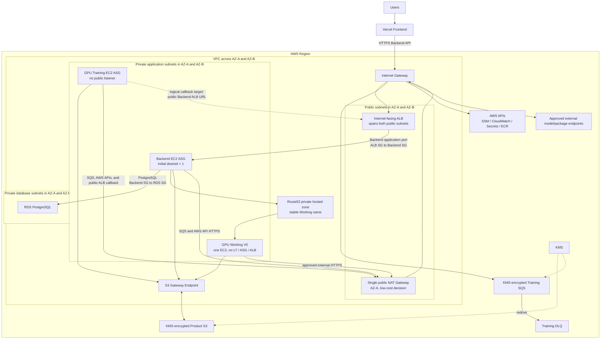

# Personal LoRA Terraform AWS Design

Status: architecture draft with confirmed ownership decisions; no Terraform or AWS deployment
exists yet.

## 1. Scope

Terraform manages the AWS infrastructure for:

- Backend API on a private EC2 ASG behind an internet-facing ALB;
- GPU Working V0 on exactly one private EC2;
- GPU Training on a private, SQS-driven GPU EC2 ASG;
- the VPC topology and service relationships;
- RDS PostgreSQL, product S3, Training SQS/DLQ, KMS, Route53 private DNS;
- IAM, instance profiles, GitHub OIDC roles, security groups, monitoring, and scaling structure.

The Vercel frontend, application source code, model training code, and model-serving code are
outside this repository.

## 2. Confirmed Topology



The diagram records the selected low-cost network. It expresses trust/routing intent, not selected
CIDRs or exact resource names.

### Confirmed egress and callback path

- Create one public NAT Gateway in the AZ-A public subnet.
- Associate both private application subnet route tables with
  `0.0.0.0/0 -> the single NAT Gateway`.
- Route the public subnets with `0.0.0.0/0 -> Internet Gateway`.
- Create an S3 Gateway Endpoint and associate it with both private application route tables.
- Do not create paid SQS/SSM/CloudWatch/Secrets Manager/ECR interface endpoints initially. These
  services use HTTPS through the NAT Gateway unless a later cost/security review changes the
  decision.
- Enable VPC DNS support and DNS hostnames.
- Training uses the public Backend domain as `TRAINING_BACKEND_BASE_URL`.
- The Training callback path is:
  `Training private EC2 -> private route table -> NAT EIP -> IGW -> public ALB -> private Backend`.

The path works because Training initiates the connection. The NAT source-translates it to the NAT
Elastic IP; no unsolicited connection from the public ALB can reach Training.

### Accepted low-cost trade-offs

- The single NAT Gateway is an egress single point of failure.
- Workloads in AZ-B incur cross-AZ data transfer when they use the AZ-A NAT.
- A NAT/AZ-A outage interrupts Training callbacks and AWS/public API access from private instances.
- S3 remains reachable through its Gateway Endpoint when the NAT path is unavailable, subject to
  the remaining VPC/AWS service health.
- Moving to one NAT per AZ is an operational upgrade, not required for the first low-cost version.

## 3. Network Layers

### Public subnets

- Internet-facing Backend ALB.
- One public NAT Gateway in AZ-A.
- Public route table path to the Internet Gateway.
- No application EC2 instances.
- ALB HTTP `80` exists only for an HTTP-to-HTTPS redirect; application traffic terminates on
  HTTPS `443`.

### Private application subnets

- Backend ASG instances.
- the single Working V0 instance.
- Training ASG instances.
- No automatic public IPv4 assignment.
- Both subnet route tables use the single AZ-A NAT for non-S3 IPv4 egress.

### Private database subnets

- RDS subnet group spanning the approved Availability Zones.
- No route from the internet.

### Private DNS

Route53 private hosted zone provides one stable Working service name that resolves to the current
Working V0 private address. Terraform updates the record as part of an instance replacement.
The zone name, record name, TTL, and whether the record uses the instance private IP or private DNS
name are `[DECISION REQUIRED]`.

## 4. Security Group Relationships

| Source | Destination | Purpose | Port |
| --- | --- | --- | --- |
| Internet | Backend ALB SG | Public HTTPS API | `443` after certificate/domain decision |
| Internet | Backend ALB SG | Redirect-only HTTP listener | `80` |
| Backend ALB SG | Backend SG | Application traffic/health | `[DECISION REQUIRED]` |
| Backend SG | RDS SG | PostgreSQL | engine port selected with RDS design |
| Backend SG | Working SG | Private inference API | runtime service port `[DECISION REQUIRED]` |
| Training through NAT EIP | Backend ALB SG | public status/control callback | `443` |
| Runtime SGs | NAT/AWS service egress | SQS, KMS, logs, SSM, secrets, ECR, external endpoints | `443` |
| Runtime SGs | S3 Gateway Endpoint | product objects | `443` |

Training receives no application ingress. RDS accepts only Backend SG traffic. Working accepts only
Backend SG application traffic. SSM replaces persistent internet SSH.

Because the callback traverses the NAT/public ALB path, an ALB security-group reference to the
Training SG cannot identify the original instance. The public ALB accepts HTTPS for the product
API; callback protection therefore requires TLS plus the runtime Bearer callback token,
`Idempotency-Key`, `callbackId`, and exact-replay behavior. WAF/rate limiting can add defense in
depth but cannot replace application authentication.

## 5. Compute

### 5.1 Backend

- EC2 Launch Template and ASG in private application subnets.
- Internet-facing ALB target group with explicit health checks.
- ASG spans both private application subnets and starts with `desired = 1`.
- Initial AMI is an exact approved ID.
- ASG references Launch Template version `$Default`.
- Routine AMI release creates an AMI-only LT version, promotes `$Default`, then starts Backend
  Instance Refresh.
- Terraform owns capacity, health checks, subnets, target group, instance profile, security groups,
  metadata, disks, tags, scaling policies, and Launch Template structure.
- Database migrations run once outside normal ASG instance startup.

Instance type, minimum/maximum capacity, warmup, health thresholds, and refresh preferences are
`[DECISION REQUIRED]`.

The local Terraform structure now expresses these as required inputs without deployment defaults.
It creates the hardened Backend LT, private two-subnet ASG, target group, internet-facing ALB,
HTTPS listener, redirect-only HTTP listener, and public alias. Backend user data contains only
resource identifiers and non-secret runtime configuration; compatibility with the real Backend AMI
remains unverified.

### 5.2 GPU Working V0 — Confirmed

- Exactly one EC2 instance in a private application subnet.
- No Launch Template.
- No Auto Scaling Group.
- No ALB or target group.
- Backend reaches it by Route53 private DNS.
- Terraform directly owns the exact approved AMI ID.
- Changing that AMI input replaces the instance and updates private DNS.
- EBS/cache/data behavior must assume instance replacement; durable adapters/manifests remain in S3.

Subnet/AZ, GPU instance type, root/cache volume sizes, service port, replacement downtime
expectation, and health validation are `[DECISION REQUIRED]`.

The local Terraform structure keeps Version 0 as exactly one private `aws_instance`, with encrypted
root/cache EBS, IMDSv2, its dedicated profile/SG, and a private Route53 A record. All runtime
limits/paths and the exact AMI remain required inputs; no Working LT, ASG, target group, ALB,
public IP, or SSH configuration exists.

### 5.3 GPU Training

- EC2 Launch Template and ASG in private application subnets.
- No ALB and no public listener.
- SQS-driven capacity/scaling design.
- Initial capacity uses On-Demand instances only.
- ASG references Launch Template version `$Default`.
- Routine AMI release creates an AMI-only LT version and promotes `$Default`.
- A release does not force Instance Refresh: protected in-flight workers remain, while future
  scale-outs use the new default.
- Worker lifecycle must set/remove scale-in protection and complete the termination lifecycle hook
  according to the runtime design.

GPU instance type, desired/min/max capacity, scale-to-zero behavior, scaling metric/threshold,
cooldowns, warmup, lifecycle-hook heartbeat, and maximum job duration are `[DECISION REQUIRED]`.

The local Terraform structure creates an On-Demand-only private LT/ASG, termination lifecycle hook,
and simple scale policies driven by CloudWatch metric math:
`IF(InService > 0, visible_messages / InService, visible_messages)`. The zero-instance branch lets
visible backlog invoke the scale-out policy. Thresholds, periods, adjustments, cooldowns, warmup,
and lifecycle results remain required evidence-derived inputs; Mock values are not deployment
defaults. Scale-in protection remains authoritative, and no routine Training refresh exists.

## 6. Data and Messaging

### Product S3

The product bucket stores approved datasets, job metadata, training logs, checkpoints, base-model
references where applicable, and LoRA artifacts. Required controls:

- public-access block and TLS-only bucket policy;
- versioning and approved KMS encryption;
- component/prefix-scoped IAM;
- retention/lifecycle rules only after product decisions;
- no secret material.

The exact object contract remains aligned with the service repositories. Existing draft paths must
be reconciled with the worker's `checkpoints/{jobId}/worker_state.json`.

### Training SQS

- KMS-encrypted main queue and DLQ.
- Backend produces; Training consumes/deletes/renews visibility.
- Initial low-cost access uses the single NAT Gateway and the regional public HTTPS endpoint; no
  paid SQS Interface Endpoint is created.
- Redrive, visibility timeout, retention, long polling, and scaling metric must match actual
  training job behavior.
- Queue policy must not provide general account-wide producer/consumer access.

### RDS PostgreSQL

- Private DB subnet group and Backend-only SG ingress.
- Encrypted storage, backups, log/metric configuration, and environment-appropriate deletion
  protection/final snapshot.
- Backend resolves credentials at runtime from the approved secret mechanism.
- Training and Working receive neither RDS network access nor RDS credentials.

## 7. KMS and Secrets

Terraform creates and owns separate rotating per-environment KMS keys for product data, Training
SQS/DLQ, and RDS/storage-managed-secret encryption. Resources in this root reference those keys
directly through `aws_kms_key.product.arn`, `aws_kms_key.training_queue.arn`, and
`aws_kms_key.database.arn`. Key policies enable account IAM authorization; consumers receive
actual use only through their scoped IAM role policies.

Secret values must not enter Terraform configuration or outputs. RDS generates and owns its master
password in Secrets Manager through `manage_master_user_password`; Terraform exposes only the
managed secret ARN. External Working authentication and Training callback secrets remain required
ARN inputs and are not created by this root.

Resources created in the same root are referenced through `aws_*.<semantic_name>.arn` or `.id`.
ARN inputs are reserved for external resources or explicit cross-PR boundaries, and are replaced
with direct references when the owning Terraform resource is added.

CloudWatch runtime and VPC Flow Log groups use a separate rotating Terraform-managed KMS key. The
Backend, Working and Training roles reference only their own Terraform-created log group ARN.
Alarm action ARNs and cost-notification emails remain required external owner inputs because this
root does not own the notification topic or recipients.

## 8. IAM Roles

| Role | Intended boundary |
| --- | --- |
| Terraform deploy | Create/update the reviewed infrastructure for one environment |
| Packer build per component | Build/tag AMIs using only required build resources |
| Release workflow per component | Component LT AMI-only versions, `$Default`, and allowed rollout |
| Backend runtime | RDS secret/connectivity, product S3 prefixes, Training queue send, logs/metrics |
| Working runtime | approved S3 prefixes/KMS, its auth secret if used, logs/metrics/SSM |
| Training runtime | Training queue, approved S3/KMS, callback secret, logs/metrics/SSM, required ASG lifecycle calls |

GitHub roles use OIDC conditions tied to the exact repository and approved ref/environment. No
long-lived workflow access keys.

Workflow repository ownership is:

| Repository | Workflow ownership |
| --- | --- |
| `terraform` | Terraform validation/plan/apply, State bootstrap, Working V0 Terraform AMI replacement |
| `small_backend` | Backend Packer build and Backend AMI release |
| `gpu_ec2` | Working/Training Packer builds and Training AMI release |

Build workflows publish immutable manifests. They do not receive Terraform State access or
LT/ASG release authority. Backend/Training release workflows consume approved manifests through
their component-scoped roles. Working deployment consumes the approved Working manifest through a
Terraform input change.

## 9. Terraform Resource Layout

The initial root layout should use focused files rather than premature modules:

```text
versions.tf
providers.tf
variables.tf
locals.tf
network.tf
endpoints.tf
security_groups.tf
kms.tf
s3.tf
sqs.tf
rds.tf
iam_deploy.tf
iam_runtime.tf
iam_workflows.tf
backend_compute.tf
working_compute.tf
training_compute.tf
dns.tf
monitoring.tf
outputs.tf
```

Backend/bootstrap configuration may be separated when the state decision is made. Reusable modules
should be introduced only after the boundaries repeat and inputs/outputs are stable.

## 10. Observability and Operations

Planned coverage:

- ALB request/target health and Backend ASG capacity/refresh alarms;
- Working process/GPU/disk/request metrics and EC2 status alarms;
- Training queue age/depth/DLQ, ASG capacity, lifecycle, GPU/disk/job metrics;
- RDS storage/connections/CPU and backup health;
- KMS/S3/SQS access/audit visibility;
- centralized, retention-controlled logs without secrets;
- budget/cost anomaly notifications after account/environment decisions.

Alarm destinations, log retention, dashboard scope, and budget thresholds are
`[DECISION REQUIRED]`.

## 11. Ownership Boundary

Terraform and release automation intentionally share the Launch Template resource at different
field boundaries:

- Terraform: structure and ASG relationship.
- Release workflow: AMI-only versions, `$Default`, and rollout command.

Implementation must use `update_default_version = false`, ASG `$Default`, and the narrow lifecycle
handling documented in `AMI_ASG_RELEASE_DESIGN.md`. Do not broadly ignore the Launch Template or
ASG, because that would conceal structural drift.

Before a Terraform structural LT update, synchronize its exact AMI input to the currently approved
`$Default` AMI. Otherwise the new structural candidate could carry the stale bootstrap image and
cause an accidental rollback when promoted.

## 12. Known Implementation Blockers

1. The input decisions listed in `ai/BASE_SETTINGS.md` are unresolved.
2. Backend/Training runtime contracts listed in `ai/INTEGRATION_CONTRACTS.md` are not aligned.
3. Training termination lifecycle-hook completion is not implemented/verified.
4. Working host packaging/AMI and a real Training AMI are not verified.
5. GPU repository governance currently describes Terraform as the sole LT/ASG writer. It must be
   synchronized with the newly confirmed, field-scoped release workflow ownership before either
   implementation is treated as authoritative.

## 13. Decision Log

### 2026-07-27 — Working Version 0

Confirmed: one private Terraform-managed Working EC2; Route53 private DNS; no Working LT, ASG, or
ALB. AMI changes replace the instance through Terraform.

### 2026-07-27 — Backend and Training AMI releases

Confirmed: initial topology is created by Terraform. Routine GitHub releases may create an
AMI-only LT version, promote `$Default`, and perform the service-specific rollout. Backend uses
Instance Refresh; Training does not force-refresh protected workers.

### 2026-07-27 — AMI identity

Confirmed: consume exact approved AMI IDs from build output. Do not query an unbounded “latest”
AMI.

### 2026-07-27 — Low-cost network egress

Confirmed: use one public NAT Gateway in AZ-A for both private application subnets. Add the free
S3 Gateway Endpoint. Defer paid interface endpoints and accept the NAT single point of failure and
AZ-B cross-AZ egress cost for the first version.

### 2026-07-27 — Backend initial capacity

Confirmed: Backend runs in a private ASG spanning two private application subnets, behind an
internet-facing ALB spanning two public subnets. Initial `desired = 1`.

### 2026-07-27 — Training callback route

Confirmed: Training remains private and calls the public Backend ALB URL through the single NAT
Gateway. The public callback endpoint uses HTTPS and application-level callback authentication;
Training has no inbound listener.

### 2026-07-28 — P1 HTTPS Egress Exception

Confirmed:

- Backend, Working, and Training security groups have no unrestricted all-protocol egress.
- Their temporary public destination scope is limited to TCP `443` because SQS, SSM, logs,
  Secrets Manager, and the public Backend callback use the single NAT in P1.
- S3 is routed through the Gateway Endpoint, but an SG cannot express that route selection or
  constrain all other AWS public-service IP ranges to stable CIDRs.
- Trivy `AVD-AWS-0104` is suppressed only on these three named HTTPS rules with inline reasons.
- A future approved Interface Endpoint PR must replace the applicable public HTTPS rules with
  endpoint-SG references before removing the suppressions.

### 2026-07-28 — State bootstrap root and redirect-only HTTP

Confirmed:

- State bootstrap uses an independently initialized Terraform root at `bootstrap/state` in this
  repository.
- Environment roots use native S3 lockfiles (`use_lockfile = true`) without a DynamoDB locking
  table.
- Terraform creates and owns the customer-managed State KMS key. The key policy enables account
  IAM authorization; Terraform bootstrap/deploy IAM policies grant actual use. Runtime program
  roles do not receive State-key access.
- The Backend ALB accepts HTTP `80` only to redirect to HTTPS `443`; no plaintext application
  listener is permitted.

### 2026-07-28 — Workflow repository ownership

Confirmed:

- Terraform deploy/State and Working V0 deployment workflows belong to `terraform`.
- Backend build/release workflows belong to `small_backend`.
- Working/Training build and Training release workflows belong to `gpu_ec2`.
- Build workflows hand off immutable AMI manifests and do not gain Terraform State or unrelated
  release permissions.

### 2026-07-28 — Local Backend, Working, and Training Compute Structure

Confirmed implementation boundary:

- the public Backend ALB is the sole public application resource and uses HTTP `80` only to
  redirect to HTTPS `443`;
- Backend and Training ASGs consume `$Default`, while Terraform owns every non-AMI LT field;
- Working V0 remains one private Terraform-managed EC2 and accepts replacement downtime;
- Training uses only On-Demand ASG capacity, a termination lifecycle hook, worker protection, and
  SQS backlog-per-InService scaling with explicit zero-worker behavior;
- runtime user data contains identifiers and non-secret settings only—no callback token, database
  password, API key, or AWS key;
- this is Mock/static implementation evidence, not proof that the real AMIs, lifecycle path,
  callback route, scale-from-zero behavior, or Backend health path work.

### 2026-07-28 — Observability and Operations Boundary

Confirmed implementation boundary:

- Terraform creates the encrypted Backend, Working, Training and VPC Flow Log groups and the Flow
  Log role/resource using direct resource references;
- required inputs carry real retention, alarm action, alarm threshold, budget and notification
  decisions; Mock recipients and values remain tests only;
- infrastructure-native ALB, SQS/DLQ, RDS, EC2 and NAT metrics are wired to alarms/dashboard;
- Terraform does not invent GPU, disk, process, callback, lifecycle or job-result metric emission
  that the consumer runtimes do not yet provide;
- SSM/no-SSH, NAT outage/two-NAT evolution, retention/deletion, Backend review and Working
  replacement procedures are documented, but no operational action is authorized by those
  documents;
- executable Backend/Training workflows remain in their owning repositories, and the Terraform
  Working workflow remains blocked until the real environment/backend/variable/approval contract
  is decided.
