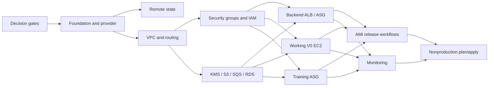

# Terraform AWS P1 Detailed Task Breakdown

Status: implementation task map. Except where explicitly marked completed, these tasks are planned
or blocked and do not represent deployed AWS resources.

## 1. How to Use This File

- Use one task ID as the normal unit of implementation and review.
- A task may share a PR with adjacent tasks only when their plan and rollback surface are the same.
- Use `TERRAFORM_P1_PR_PLAN.md` as the authoritative mapping from these task IDs to proposed PR
  review surfaces.
- Resolve only the decision gates required by the next task group.
- Every material task updates `TERRAFORM_DEV_DOC.md`.
- Architecture changes update `TERRAFORM_AWS_DESIGN.md`.
- AMI/LT/ASG release changes update `AMI_ASG_RELEASE_DESIGN.md`.
- Local validation is not deployment evidence.
- `plan`, `apply`, state mutation, Packer builds, workflow dispatch, and AWS mutations require the
  execution authorization defined in root `AGENTS.md`.

Status values:

- **Completed locally**: files/command evidence exist locally.
- **Ready**: dependencies and owner decisions are available.
- **Planned**: task is defined but an earlier implementation dependency remains.
- **Blocked**: a named decision or cross-repository contract is missing.
- **Requires authorization**: implementation is ready but the action changes or reads a named live
  environment.

## 2. Confirmed Inputs

- Terraform binary currently available: `v1.13.3` on `darwin_arm64`.
- Frontend remains on Vercel.
- Backend: private ASG across two private application subnets, public ALB, initial `desired = 1`.
- Working V0: exactly one private EC2, Route53 private DNS, no LT/ASG/ALB.
- Training: private On-Demand ASG, SQS-driven, no public listener.
- Two-AZ topology for ALB/ASG/RDS subnet coverage.
- One public NAT Gateway in AZ-A for the first low-cost version.
- Both private application subnets use the single NAT for non-S3 IPv4 egress.
- S3 uses a Gateway Endpoint; paid interface endpoints are deferred.
- Training calls the public Backend ALB URL through NAT.
- Backend and Training routine AMI releases use the approved `$Default` pointer model.
- Working AMI replacement is Terraform-managed.

## 3. Decision Gates

| ID | Required decision | Blocks | Status |
| --- | --- | --- | --- |
| DEC-001 | AWS account ID(s), region, environment names | provider, state, all regional resources | `[PARTIALLY CONFIRMED]` local work uses a test ID with Mock AWS; real ID required before `VAL-004`; region/environments remain required |
| DEC-002 | Project prefix, owner/cost tags, environment naming rules | resource names, default tags | `[DECISION REQUIRED]` |
| DEC-003 | VPC CIDR, exact AZ names, six subnet CIDRs, IPv6 choice | network | `[DECISION REQUIRED]` |
| DEC-004 | State bucket name/key convention, bootstrap owner, locking method | remote backend | `[DECISION REQUIRED]` |
| DEC-005 | Public domain, certificate ownership, ALB listeners, Backend port/health path | Backend ALB | `[DECISION REQUIRED]` |
| DEC-006 | Backend AMI, instance type, min/max, warmup and refresh preferences | Backend compute | `[DECISION REQUIRED]` |
| DEC-007 | Working AMI, GPU type, subnet/AZ, port, disks/cache, auth and DNS name | Working compute | `[DECISION REQUIRED]` |
| DEC-008 | Training AMI/GPU type, min/desired/max, queue timing and job duration | Training compute/scaling | `[DECISION REQUIRED]` |
| DEC-009 | KMS key split, S3 retention, SQS redrive/retention, log retention | data/monitoring | `[DECISION REQUIRED]` |
| DEC-010 | RDS engine/version/class/storage/Multi-AZ/backups/deletion policy and credential owner | RDS | `[DECISION REQUIRED]` |
| DEC-011 | Exact GitHub org/repo slugs, refs/environments and approval rules for the confirmed workflow owners | workflow IAM | `[PARTIALLY CONFIRMED]` repository ownership decided 2026-07-28 |
| DEC-012 | Terraform deploy execution details and approval boundary within the confirmed `terraform` repository ownership | deploy IAM/workflow | `[PARTIALLY CONFIRMED]` repository ownership decided 2026-07-28 |

## 4. Dependency Overview

## 5. Repository and Terraform Foundation

| ID | Task description | Depends on | Completion evidence |
| --- | --- | --- | --- |
| FND-000 | Run Terraform initialization in the empty repository and record the actual result. | none | **Completed locally 2026-07-27**: Terraform v1.13.3 returned `Terraform initialized in an empty directory!`; no configuration/provider/backend was initialized. |
| FND-001 | Add `.gitignore` entries for `.terraform/`, state/backup files, plan artifacts, crash logs, override files, and local secret tfvars while preserving the provider lock file. | none | **Completed locally 2026-07-28**: ignore rules cover generated/state/plan/secret artifacts and explicitly retain `.terraform.lock.hcl`. |
| FND-002 | Create `versions.tf` with an approved Terraform constraint and pinned-compatible AWS provider constraint. | DEC-001 | **Completed locally 2026-07-28**: Terraform is constrained to `>= 1.13.3, < 1.14.0`; AWS provider to `~> 6.47.0`; format check passed. |
| FND-003 | Create `providers.tf` with the selected region, allowed-account validation, and default tags. | DEC-001, DEC-002, FND-002 | **Completed locally 2026-07-28**: provider has no credentials, requires region/account inputs, restricts allowed account IDs, and applies deterministic default tags. |
| FND-004 | Create typed common variables for project, environment, region, account, tags, CIDRs, and feature switches. | DEC-001, DEC-002, DEC-003 | **Completed locally 2026-07-28**: typed, described and validated foundation inputs exist with no live-environment defaults. |
| FND-005 | Create `locals.tf` for normalized names, merged tags, service identifiers, and repeated constants. | FND-004 | **Completed locally 2026-07-28**: names/tags and IPv4 CIDR ranges are deterministic. |
| FND-006 | Add Terraform `check`/precondition rules for account, CIDR non-overlap, two distinct AZs, capacity bounds, exact AMI format, and no public EC2 assignment. | FND-004 | **Completed locally 2026-07-28**: valid and invalid fixtures passed 9 mock-provider tests, including CIDR containment/overlap and capacity/public-IP failures. |
| FND-007 | Re-run `terraform init` after provider configuration and commit the generated `.terraform.lock.hcl`. | FND-002, FND-003 | **Completed locally 2026-07-28**: `terraform init -backend=false` installed AWS provider `6.47.0`; checksum lock is committed by `foundation-validation`; `.terraform/` remains ignored. |
| FND-008 | Run baseline `terraform fmt -check -recursive` and `terraform validate`; record exact versions/results. | FND-007 | **Completed locally 2026-07-28**: recursive format check and `terraform validate -no-color` both exited `0`. |

## 6. State Bootstrap and Access

| ID | Task description | Depends on | Completion evidence |
| --- | --- | --- | --- |
| STATE-001 | Write the state bootstrap decision: bucket name, region, key layout, encryption key, locking, versioning, recovery, break-glass owner, and environment separation. | DEC-001, DEC-004 | **Partially completed locally 2026-07-28**: S3 lockfile, Terraform-owned KMS key, IAM-managed use, versioning, recovery boundary and key layout contract are documented; real bucket/region/principals remain required. |
| STATE-002 | Use a separate Terraform root at `bootstrap/state`; prevent dependency on the backend it creates. | STATE-001 | **Decision confirmed 2026-07-28**: independently initialized root in this repository; implementation and teardown/recovery controls remain `state-bootstrap` work. |
| STATE-003 | Implement the bootstrap configuration with S3 encryption, versioning, public-access block, TLS-only policy, and least-privilege access. | STATE-002 | **Completed locally 2026-07-28**: independent init/validate and Mock tests passed; Terraform-managed KMS key rotation and IAM delegation are enforced; no live bucket/key exists. |
| STATE-004 | Create the environment backend configuration and document partial backend arguments that must be supplied outside Git. | STATE-003 | **Completed locally 2026-07-28**: partial S3 backend uses `use_lockfile = true`; README keeps bucket/key/region/account inputs outside Git. |
| STATE-005 | Provision/bootstrap the state resources in the named account. | STATE-003 | **Requires explicit authorization**; resource IDs and command evidence recorded. |
| STATE-006 | Reinitialize/migrate the root state to the remote backend and verify locking/version recovery. | STATE-004, STATE-005 | **Requires explicit authorization**; migration and lock test evidence recorded. |

## 7. VPC, Subnets, Routing, and DNS Foundation

| ID | Task description | Depends on | Completion evidence |
| --- | --- | --- | --- |
| NET-001 | Record the selected VPC/AZ/subnet CIDR map and prove that all six subnet CIDRs are contained and non-overlapping. | DEC-003, FND-004 | **Validation completed locally 2026-07-28** with contained/non-overlapping Mock CIDRs; real CIDR/AZ allocation remains `[DECISION REQUIRED]`. |
| NET-002 | Implement VPC with DNS support/hostnames enabled and required tags. | NET-001 | **Completed locally 2026-07-28**: VPC Mock plan enables DNS support/hostnames and uses explicit tags. |
| NET-003 | Implement two public subnets, one in each selected AZ, with public-IP auto-assignment disabled by default. | NET-002 | **Completed locally 2026-07-28**: two Mock-planned public subnets have public-IP auto-assignment disabled. |
| NET-004 | Implement two private application subnets for Backend/Working/Training. | NET-002 | **Completed locally 2026-07-28**: two private application subnet resources validate. |
| NET-005 | Implement two private DB subnets reserved for RDS. | NET-002 | **Completed locally 2026-07-28**: two private DB subnet resources validate. |
| NET-006 | Implement and attach the Internet Gateway plus public route table and `0.0.0.0/0 -> IGW`. | NET-003 | **Completed locally 2026-07-28**: IGW, public route table/default route and two associations validate. |
| NET-007 | Allocate one EIP and implement the single public NAT Gateway in AZ-A. | NET-006 | **Completed locally 2026-07-28**: one VPC EIP/NAT resource targets `public_a`; no live allocation exists. |
| NET-008 | Implement private application route tables for both AZs with `0.0.0.0/0 -> single NAT`. | NET-004, NET-007 | **Completed locally 2026-07-28**: two application route tables/default routes use the single NAT resource. |
| NET-009 | Implement DB route table associations with local-only routing unless a later RDS requirement is approved. | NET-005 | **Completed locally 2026-07-28**: two DB route tables/associations contain no internet default route. |
| NET-010 | Implement the S3 Gateway Endpoint and associate it with both private application route tables. | NET-008 | **Completed locally 2026-07-28**: Gateway Endpoint attaches both application route tables and policy requires approved bucket ARNs. |
| NET-011 | Implement Route53 private hosted zone association for the VPC. | NET-002, DEC-007 | **Completed locally 2026-07-28**: private zone uses a required name and direct `aws_vpc.main.id` association; real name remains required. |
| NET-012 | Add network outputs: VPC ID, subnet IDs by class/AZ, route table IDs, NAT EIP, and private zone ID. | NET-003 through NET-011 | **Completed locally 2026-07-28**: semantic outputs expose only resource-derived identifiers/EIP and no secrets. |
| NET-013 | Add VPC Flow Logs destination/role after retention and destination are decided. | DEC-009, NET-002 | **Implemented locally 2026-07-28** with a dedicated least-privilege role and Terraform-managed encrypted log group; real retention/traffic scope remain required inputs. |

## 8. Security Groups and IAM Foundation

| ID | Task description | Depends on | Completion evidence |
| --- | --- | --- | --- |
| SG-001 | Create separate ALB, Backend, Working, Training, RDS, and endpoint security groups with no implicit default-SG use. | NET-002 | **Completed locally 2026-07-28**: six explicit groups validate with empty inline ingress/egress and standalone rules. |
| SG-002 | Allow public ALB ingress on HTTPS 443 and HTTP 80 for redirect-only traffic. | DEC-005, SG-001 | **Completed locally 2026-07-28**: only ALB rules expose `80`/`443`; port `80` remains reserved for the later redirect listener. |
| SG-003 | Allow ALB SG to Backend SG on application and health-check ports only. | DEC-005, SG-001 | **Completed locally 2026-07-28**: Backend ingress/ALB egress use direct SG references and required port input. |
| SG-004 | Allow Backend SG to Working SG on the confirmed private inference port only. | DEC-007, SG-001 | **Completed locally 2026-07-28**: bidirectional rule pair uses SG references and required Working port input. |
| SG-005 | Keep Training application ingress empty; define only required HTTPS/DNS egress. | SG-001 | **Completed locally 2026-07-28**: Training has no ingress rule and only TCP `443` egress. |
| SG-006 | Allow Backend SG to RDS SG on the selected PostgreSQL engine port only. | DEC-010, SG-001 | **Completed locally 2026-07-28**: Backend/database rules use SG references and required DB port input; Working/Training have no DB path. |
| SG-007 | Encode runtime HTTPS egress through NAT/S3 endpoint without pretending the public callback preserves Training SG identity. | SG-001, NET-010 | **Completed locally 2026-07-28**: TCP `443` NAT egress has documented Trivy exception/exit condition; no callback source-SG claim. |
| IAM-001 | Implement the Terraform deploy policy boundary for one environment, including narrowly scoped `iam:PassRole`. | DEC-012, FND-005 | **Implemented locally 2026-07-28**: PassRole is limited to direct environment role references; broad service creation remains isolated in the deploy role. |
| IAM-002 | Implement Backend runtime role/profile for S3 prefixes, SQS send, approved DB secret, KMS, logs/metrics, and SSM. | DATA-001 through DATA-007 | **Implemented locally 2026-07-28** with direct SQS/KMS/RDS managed-secret references and no Training lifecycle authority. |
| IAM-003 | Implement Working runtime role/profile for approved S3/KMS prefixes, optional auth secret, logs/metrics, and SSM. | DEC-007, DATA-001 through DATA-004 | **Implemented locally 2026-07-28**; external auth-secret/log-group ARNs remain deployment inputs. |
| IAM-004 | Implement Training runtime role/profile for SQS consume/visibility/delete, approved S3/KMS, callback secret, logs/metrics, SSM, and required ASG lifecycle calls. | DEC-008, DATA-001 through DATA-007 | **Implemented locally 2026-07-28** with one callback-secret input and no RDS/general EC2 authority. |
| IAM-005 | Implement GitHub OIDC provider/trust conditions without long-lived access keys. | DEC-011 | **Implemented locally 2026-07-28** with exact required subject sets; real repositories/subjects remain deployment inputs. |
| IAM-006 | Implement separate Backend/Training Packer and release roles; do not combine build, release, deploy, or runtime authority. | IAM-005, RELEASE-001 | **Structurally implemented locally 2026-07-28**; activation remains blocked on EXT-03 and future direct LT/ASG references. |
| IAM-007 | Add IAM policy tests/review for wildcard resources, KMS encryption context, secret scope, `iam:PassRole`, LT/ASG mutations, and public access. | IAM-001 through IAM-006 | **Partially completed locally 2026-07-28**: exact OIDC and role separation tests added; real IAM simulation/governance review remains pending. |

## 9. Encryption, S3, SQS, Secrets, and RDS

| ID | Task description | Depends on | Completion evidence |
| --- | --- | --- | --- |
| DATA-001 | Decide and implement the KMS key/alias model for product S3, Training SQS, and other approved encrypted resources. | DEC-009, FND-005 | **Completed locally 2026-07-28**: Terraform owns separate rotating product, Training SQS/DLQ, and database KMS keys; resources and consumer IAM use direct key references. |
| DATA-002 | Implement product S3 bucket with versioning, KMS default encryption, ownership controls, and public-access block. | DATA-001 | **Completed locally 2026-07-28**: bucket directly references `aws_kms_key.product.arn`; Endpoint policy directly references `aws_s3_bucket.product.arn`. |
| DATA-003 | Implement TLS-only bucket policy and component/prefix policy documents. | DATA-002 | **Completed locally 2026-07-28**: TLS-only policy and explicit Backend/Working/Training read/write-prefix IAM JSON validate. |
| DATA-004 | Implement only approved lifecycle/retention rules for datasets, logs, checkpoints, and adapters. | DEC-009, DATA-002 | **Completed locally 2026-07-28 with no lifecycle rules**: no retention value was invented; durable data is not expired. |
| DATA-005 | Implement KMS-encrypted Training queue and DLQ. | DEC-008, DEC-009, DATA-001 | **Completed locally 2026-07-28**: queue and DLQ directly reference a dedicated Terraform-managed rotating KMS key; non-secret outputs exist. |
| DATA-006 | Implement redrive, visibility, retention, long polling, receive count, and queue policy from the runtime contract. | DATA-005 | **Completed locally 2026-07-28** with required inputs and a visibility-at-least-two-renewals check. |
| DATA-007 | Add SQS/DLQ alarms for visible age/count and dead-letter arrival. | DATA-005, OBS-001 | **Structurally implemented locally 2026-07-28** with direct queue dimensions and required thresholds/action ARNs; Mock values are not owner approval. |
| RDS-001 | Implement private DB subnet group across the two DB subnets. | NET-005 | **Completed locally 2026-07-28** with direct references to both private database subnets. |
| RDS-002 | Implement encrypted PostgreSQL RDS configuration from the approved engine/class/storage/backup decisions. | DEC-010, DATA-001, RDS-001, SG-006 | **Completed locally 2026-07-28** with private access, direct KMS/SG references, required backup/deletion inputs, and `prevent_destroy`. |
| RDS-003 | Implement parameter/option/log export/monitoring settings required by the Backend. | DEC-010, RDS-002 | **Completed locally 2026-07-28** as required engine/family/log/monitoring inputs; real values remain deployment decisions. |
| RDS-004 | Integrate an existing/managed credential secret by ARN without passing the secret value through Terraform state. | DEC-010, RDS-002 | **Completed locally 2026-07-28** using the RDS-managed master password; only its resource-derived secret ARN is output. |
| RDS-005 | Define the one-time migration runner/release step; prohibit migrations from every ASG instance startup. | Backend contract decision, RDS-002 | **Boundary documented locally 2026-07-28** in `BACKEND_MIGRATION_RUNBOOK.md`; executable owner/lock implementation remains `[DECISION REQUIRED]`. |

## 10. Backend ALB and ASG

| ID | Task description | Depends on | Completion evidence |
| --- | --- | --- | --- |
| BE-001 | Freeze Backend runtime inputs: exact AMI, port, health path, instance type, min/max, desired=1, warmup and refresh values. | DEC-005, DEC-006 | **Input contract implemented locally 2026-07-28** with required validated values and Mock-only fixtures; real values/artifact remain pending. |
| BE-002 | Define non-secret Backend user data/runtime environment identifiers for RDS, S3, SQS, Working DNS, logs, and environment. | BE-001, RDS-004, DATA-002, DATA-005, NET-011 | **Implemented locally 2026-07-28** with direct resource identifiers and secret ARNs only; real Backend AMI consumption remains unverified. |
| BE-003 | Implement Backend Launch Template structure: exact bootstrap AMI, instance profile, SG, IMDSv2, encrypted EBS, user data and tags. | BE-002, IAM-002, SG-003 | **Implemented locally 2026-07-28** with `update_default_version = false`, AMI-only ignore, IMDSv2, encrypted EBS and direct profile/SG references. |
| BE-004 | Implement target group, health checks, deregistration delay, and Backend ASG across both private application subnets. | BE-003, NET-004 | **Implemented locally 2026-07-28** with desired one, two private subnets, ELB health, target attachment and `$Default`; no live plan. |
| BE-005 | Implement internet-facing ALB across both public subnets with ALB SG. | DEC-005, NET-003, SG-002 | **Implemented locally 2026-07-28** as the only public application resource with an exact documented Trivy exception. |
| BE-006 | Implement HTTPS listener/certificate and optional HTTP-to-HTTPS redirect; add public DNS record. | DEC-005, BE-005 | **Implemented locally 2026-07-28** with required external ACM/zone inputs and redirect-only HTTP; real TLS/domain unverified. |
| BE-007 | Configure ASG to consume LT `$Default` and define safe Instance Refresh preferences. | BE-004 | **Implemented locally 2026-07-28**: ASG consumes `$Default`; preferences are validated output only and Terraform starts no refresh. Governance/live drift tests remain pending. |
| BE-008 | Add Backend/ALB alarms and logs for target health, 5xx, latency, instance status, ASG capacity and refresh failures. | BE-004, BE-005, OBS-001 | **Partially implemented locally 2026-07-28**: encrypted Backend logs plus ALB target-health/5xx/latency alarms use direct dimensions; app/refresh outcome metrics require runtime/workflow emission. |
| BE-009 | Validate the one-time migration path before Backend rollout. | RDS-005, BE-007 | Migration does not race from multiple ASG instances. |
| BE-010 | Perform local Backend plan review for public exposure, replacement, LT lifecycle, desired=1, RDS access and outputs. | BE-001 through BE-009, VAL-001 | **Static checklist completed locally 2026-07-28** in `SERVICE_VALIDATION_RUNBOOK.md`; saved-plan evidence requires live-plan authorization. |

## 11. GPU Working V0

| ID | Task description | Depends on | Completion evidence |
| --- | --- | --- | --- |
| WK-001 | Resolve Working host packaging/AMI blocker and freeze exact AMI, GPU type, port, disk/cache, auth, subnet/AZ and DNS inputs. | DEC-007, GPU repository evidence | **Terraform input surface implemented locally 2026-07-28; still blocked** because real AMI/build/TLS and measured runtime values do not exist. |
| WK-002 | Define non-secret Working runtime configuration and secret identifiers required by `INTEGRATION_CONTRACTS.md`. | WK-001, DATA-002, IAM-003 | **Implemented locally 2026-07-28** for every named Working setting using identifiers/non-secret values; real AMI consumption unverified. |
| WK-003 | Implement one private `aws_instance` with exact AMI, Working SG/profile, IMDSv2 and encrypted volumes. | WK-002, NET-004, SG-004, IAM-003 | **Structurally implemented locally 2026-07-28** as one private instance with encrypted root/cache volumes; no LT/ASG/TG/ALB/public IP/SSH. |
| WK-004 | Implement Route53 private A record and replacement dependency behavior. | WK-003, NET-011 | **Implemented locally 2026-07-28** with direct private-IP reference and zone membership check; replacement/downtime unverified. |
| WK-005 | Add Working status/GPU/disk/process/request/log alarms. | WK-003, OBS-001 | **Partially implemented locally 2026-07-28**: encrypted Working logs and EC2 status alarm exist; GPU/disk/process/request metrics require runtime emission. |
| WK-006 | Document and test the Terraform AMI replacement/rollback sequence, including DNS update and expected downtime. | WK-004 | **Procedure documented locally 2026-07-28** in `SERVICE_VALIDATION_RUNBOOK.md`; replacement/DNS/downtime evidence requires authorized nonproduction apply. |
| WK-007 | Verify Backend-to-Working SG/DNS/application path and deny public/Training access. | WK-004, BE-004 | **Requires deployed nonproduction environment**; connectivity/denial evidence recorded. |

## 12. GPU Training ASG and SQS Scaling

| ID | Task description | Depends on | Completion evidence |
| --- | --- | --- | --- |
| TR-001 | Align Backend message schema, model identity, callback auth/body, exact replay, and job-control endpoint with Training. | cross-repository blocker | Backend and GPU design/tests agree; otherwise remaining Training deployment tasks stay blocked. |
| TR-002 | Implement and test Training scale-in protection plus termination lifecycle-hook completion path in the runtime. | cross-repository blocker | Runtime evidence covers success, failure, retry, timeout and shutdown. |
| TR-003 | Produce/verify exact Training AMI and freeze GPU type, min/desired/max, job duration, queue visibility/renewal and callback inputs. | DEC-008, TR-001, TR-002 | **Terraform input surface implemented locally 2026-07-28; still blocked** on real AMI/runtime and EXT-01/02 evidence. |
| TR-004 | Define non-secret Training runtime configuration and callback secret ARN/field. | TR-003, DATA-005, IAM-004 | **Implemented locally 2026-07-28** for every named Training setting with no secret value in user data. |
| TR-005 | Implement Training Launch Template with exact bootstrap AMI, role, SG, IMDSv2, encrypted EBS, user data and tags. | TR-004, NET-004, SG-005, IAM-004 | **Structurally implemented locally 2026-07-28** with `$Default` ownership boundary, encrypted volumes, IMDSv2 and no listener/public IP. |
| TR-006 | Implement Training ASG across private application subnets with On-Demand instances and confirmed min/desired/max. | TR-005 | **Structurally implemented locally 2026-07-28** across both private subnets with min/desired zero, On-Demand-only capacity and no refresh. |
| TR-007 | Implement termination lifecycle hook, heartbeat timeout, default result, notification/event path, and runtime permissions. | TR-002, TR-006 | **Partially implemented locally 2026-07-28**: hook/timeouts/result and direct ASG IAM exist; runtime completion/event evidence remains blocked on EXT-02. |
| TR-008 | Implement scale-in protection permissions and document the exact set/remove boundaries. | TR-002, IAM-004, TR-006 | **IAM/structure implemented locally 2026-07-28** with direct own-ASG scope; actual protection behavior remains blocked on EXT-02. |
| TR-009 | Implement SQS backlog-per-InService-instance metric math and scaling policy, including scale-from-zero behavior. | DATA-006, TR-006 | **Structurally implemented locally 2026-07-28** with explicit zero-worker expression and required evidence-derived thresholds; real scaling unverified. |
| TR-010 | Configure `TRAINING_BACKEND_BASE_URL` to the public Backend domain and validate the NAT callback route. | BE-006, NET-008, TR-004 | **Configuration implemented locally 2026-07-28** from the direct Backend DNS resource; callback contract/NAT path remains unverified and blocked on EXT-01. |
| TR-011 | Add Training alarms/logging for queue age/DLQ, ASG capacity, lifecycle timeout, GPU/disk, callback failure and job outcome. | TR-006 through TR-010, OBS-001 | **Partially implemented locally 2026-07-28**: encrypted Training logs, queue/DLQ alarms and capacity dashboard exist; lifecycle/GPU/disk/callback/job metrics require runtime emission. |
| TR-012 | Validate that `$Default` promotion affects new scale-outs without terminating protected mixed-version workers. | TR-006, RELEASE-004 | Requires nonproduction release authorization and recorded instance AMI/LT/lifecycle evidence. |

## 13. Observability, Cost, and Operations

| ID | Task description | Depends on | Completion evidence |
| --- | --- | --- | --- |
| OBS-001 | Decide notification destinations, log retention, alarm severity conventions, dashboard scope and budget thresholds. | DEC-009 | **Input contract implemented locally 2026-07-28** with no defaults; real recipients, retention, thresholds and owner approval remain required. |
| OBS-002 | Implement component log groups with encryption/retention and explicit names. | OBS-001, DATA-001 | **Implemented locally 2026-07-28** with a rotating Terraform-managed KMS key, direct references and component-scoped runtime write IAM. |
| OBS-003 | Implement shared CloudWatch dashboard for ALB/Backend, RDS, Working, Training, SQS/DLQ and NAT. | service alarms | **Implemented locally 2026-07-28** with dimensions derived from Terraform resources; real metric population remains unverified. |
| OBS-004 | Implement NAT health/traffic/error alarms and cost visibility for the accepted single-NAT design. | NET-007, OBS-001 | **Implemented locally 2026-07-28** with NAT error/drop alarms and traffic dashboard; real alert behavior remains unverified. |
| OBS-005 | Implement AWS Budget/Cost Anomaly alerts after account recipients/thresholds are approved. | DEC-001, OBS-001 | **Structurally implemented locally 2026-07-28** with required recipient/threshold inputs; real values and AWS delivery remain unverified. |
| OPS-001 | Write SSM access runbook with IAM session control and no inbound SSH. | IAM runtime roles | **Documented locally 2026-07-28** in `OPERATIONS_RUNBOOK.md`; operator/audit destination and live session evidence remain pending. |
| OPS-002 | Write single-NAT outage behavior and future two-NAT upgrade/rollback runbook. | NET-007 | **Documented locally 2026-07-28** including S3 endpoint limitations and route-first rollback; no route was changed. |
| OPS-003 | Write resource deletion/retention runbook for RDS, S3, AMIs, snapshots, logs and state. | data decisions | **Documented locally 2026-07-28** with explicit approvals/evidence and no destructive command. |

## 14. AMI Build and Release Integration

| ID | Task description | Depends on | Completion evidence |
| --- | --- | --- | --- |
| RELEASE-001 | Synchronize GPU governance from “Terraform sole LT/ASG writer” to the approved field-scoped `$Default` workflow model. | owner-approved design | GPU design/dev docs and Terraform release design no longer conflict. |
| RELEASE-002 | Standardize Packer manifest output: exact AMI ID, account/region, component, commit, build run, architecture, container digest and checks actually run. | component build repositories | Release consumes the manifest, not an AMI name search. |
| RELEASE-003 | Implement Backend OIDC release workflow: lock, validate AMI, clone `$Default`, ImageId-only diff, promote, refresh, verify and rollback. | IAM-005, IAM-006, BE-007, RELEASE-002 | Nonproduction evidence verifies actual instance AMI/LT/ALB health. |
| RELEASE-004 | Implement Training OIDC release workflow: lock, validate AMI, clone `$Default`, ImageId-only diff, promote, verify new launches, no forced refresh. | IAM-005, IAM-006, TR-006, RELEASE-002 | Protected jobs remain; mixed-version draining is observable. |
| RELEASE-005 | Implement Working release workflow as an approved Terraform AMI input update/plan/apply path; prohibit LT/ASG API calls. | WK-006, DEC-012 | **Execution contract documented locally 2026-07-28**; workflow file is blocked on DEC-012 real environment/backend/variable/plan-artifact policy. |
| RELEASE-006 | Add per-component/environment GitHub concurrency controls and stale-default compare-before-promote guard. | RELEASE-003 through RELEASE-005 | **Static contract documented locally 2026-07-28**; executable controls belong in the owning workflows and remain blocked. |
| RELEASE-007 | Add rollback evidence collection for prior/new default, AMI, LT version, instance IDs, lifecycle, ALB/app health and Training job state. | RELEASE-003, RELEASE-004 | **Evidence schema documented locally 2026-07-28**; no rollback was run. |
| RELEASE-008 | Test Terraform drift cases: no release, AMI-only external release, structural drift, and structural update after a prior AMI release. | RELEASE-003, RELEASE-004 | **Static/live test matrix documented locally 2026-07-28**; actual drift cases require external workflows and authorized nonproduction AWS. |

## 15. Validation and Deployment Gates

| ID | Task description | Depends on | Completion evidence |
| --- | --- | --- | --- |
| VAL-001 | Run `terraform fmt -check -recursive`, `terraform init -backend=false`, and `terraform validate`. | any Terraform code change | **Completed locally 2026-07-28 for the foundation root**: all three commands exited `0`; no backend, live plan, AWS credentials, or AWS API operation was used. |
| VAL-002 | Add/configure selected lint/security/policy tools and pin their versions. | FND-002 | **Completed locally 2026-07-28**: TFLint `0.64.0` plus AWS ruleset `0.48.0` returned no issues; Trivy `0.72.0` returned zero HIGH/CRITICAL Terraform misconfigurations. |
| VAL-003 | Add deterministic tests or fixture validation for account IDs, CIDRs, names/tags, capacity bounds, policies and lifecycle ownership. | FND-006, implementation | **Completed locally 2026-07-28**: `terraform test -no-color` passed 9/9 cases through `mock_provider "aws"` and test-only Account ID `123456789012`; AWS credentials were not used. |
| VAL-004 | Generate a saved nonproduction plan in the named account/region/environment. | implementation complete | **Requires explicit authorization and the real Account ID/credentials**; plan artifact handled securely. |
| VAL-005 | Review the plan for creates/replacements/destroys, public paths, NAT routes, IAM/KMS, secret/state exposure, LT/ASG lifecycle, RDS/S3 retention and expected cost. | VAL-004 | Human-readable review checklist and decision recorded. |
| VAL-006 | Apply the approved nonproduction plan without `-target`. | VAL-005 | **Requires explicit authorization**; exact apply evidence/resource IDs recorded. |
| VAL-007 | Run network/security smoke tests: public ALB, private Backend/RDS/Working, Training NAT callback, S3 endpoint, SQS via NAT, no SSH/public EC2, and negative SG/IAM cases. | VAL-006 | Success and denial evidence recorded for each path. |
| VAL-008 | Run service release/rollback and ASG lifecycle tests for Backend, Working and Training. | VAL-006, release workflows | Real instance/AMI/LT/health/job evidence recorded. |
| VAL-009 | Update all design/dev records and classify each milestone as implemented, deployed or verified using evidence. | VAL-001 through VAL-008 | No planned or local-only task is mislabeled production-ready. |

## 16. Recommended Execution Waves

### Wave 0 — Decisions and local foundation

`DEC-001` through `DEC-004`, then `FND-001` through `FND-008`.

### Wave 1 — State and network

`STATE-001` through `STATE-004`, then `NET-001` through `NET-012`.
Live state bootstrap/migration remains separately authorized.

### Wave 2 — Encryption, data, SG, and runtime IAM

`DATA-001` through `DATA-007`, `RDS-001` through `RDS-005`, `SG-001` through `SG-007`, and
`IAM-001` through `IAM-007`.

### Wave 3 — Service compute

- Backend: `BE-001` through `BE-010`.
- Working: `WK-001` through `WK-007`.
- Training: resolve `TR-001`/`TR-002`, then `TR-003` through `TR-012`.

The three service branches can progress in parallel after their shared network/data/IAM
dependencies are stable.

### Wave 4 — Release, observability, and nonproduction verification

`OBS-*`, `OPS-*`, `RELEASE-*`, then `VAL-004` through `VAL-009`.

## 17. Recommended Next Task

Resolve DP-01 through DP-03 from `TERRAFORM_P1_PR_PLAN.md`, covering `DEC-001` through `DEC-004`.
Then implement `foundation-toolchain`, `foundation-provider-inputs`, `foundation-validation`, and
`state-bootstrap` in order. Do not start service compute from placeholder account,
CIDR, state, provider, AMI or runtime values.
